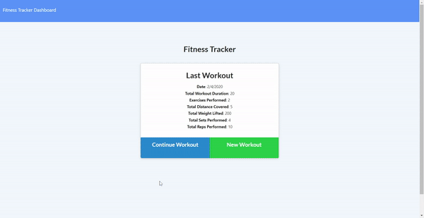

# Fitness Tracker

Fitness tracker is an app that keeps track of your workouts. For each workout, you can log any number of exercises. It also logs all your data in charts for easy viewing. All the information is saved on a database in the server. 

## Deployed Link

https://mighty-harbor-67843.herokuapp.com/?id=5e3a24fca6122e00176470ab

## Code Snipets 
```javascript
const mongoose = require("mongoose");

const Schema = mongoose.Schema;

const WorkoutSchema = new Schema({
    day: Date,

    exercises:[
        {
            type: Schema.Types.ObjectId,
            ref: "Exercise"
        }
    ],
    totalDuration: {
        type: Number,
        default: 0
    }
});

const Workout = mongoose.model("Workout", WorkoutSchema);

module.exports = Workout;
```
This app uses MongoDB and mongoose to make database queries. The above snipet shows the schema for the workouts. The "exercise" field references the schema for the exercises and the totalDuration defaults to 0 (this valued is modified each time an exercise is added).

```javascript
app.put("/api/workouts/:id", (req, res) => {
    console.log(req.body);

    db.Exercise.create(req.body)
        .then((dbExercise) => db.Workout.findOneAndUpdate(
            {_id: req.params.id},
            { 
                $push: {
                    exercises: dbExercise._id 
                }, 
                $inc: {
                    totalDuration: dbExercise.duration
                } 
            },
            { new: true })
        )
        .then(dbWorkout => {
        res.json(dbWorkout);
        }).catch(err => {
            res.json(err);
        });
    });

app.post("/api/workouts",(req,res)=>{
    db.Workout.create({day: Date.now()})
        .then(workout=>{
            res.json(workout);
        }).catch(err=>{
            res.json(err);
        });
});
```
These are the server routes used for creating workouts and exercises. The exercises are generated through a put request rather than a post request so that the workout can be updated with the new exercise's id. To ensure the right workout is updated, the workout id is passed from the client side as a request parameter. The exercise id is then pushed into the workout's exercise field, and its totalDuration field is incremented by an amount equal to the exercise's duration field.

## Live Demo



## Built With
* [MongoDB](https://docs.mongodb.com/manual/)
* [mongoose](https://www.npmjs.com/package/mongoose)
* [express](https://www.npmjs.com/package/express)
* [node.js](https://nodejs.org/en/)
* [Bootstrap](https://getbootstrap.com/)
* [HTML](https://developer.mozilla.org/en-US/docs/Web/HTML)
* [CSS](https://developer.mozilla.org/en-US/docs/Web/CSS)
* [Javascript](https://developer.mozilla.org/en-US/docs/Web/JavaScript)
* [Git](https://git-scm.com/)
* [GitHub](https://github.com/)
* [VSCode](https://code.visualstudio.com/)

## Author

**Yalí Miranda** 

* [Github](https://github.com/yjmiranda)
* [LinkedIn](https://www.linkedin.com/in/yal%C3%AD-miranda-8b4b94199/)
* [Portfolio](https://yjmiranda.github.io/portfolio/)